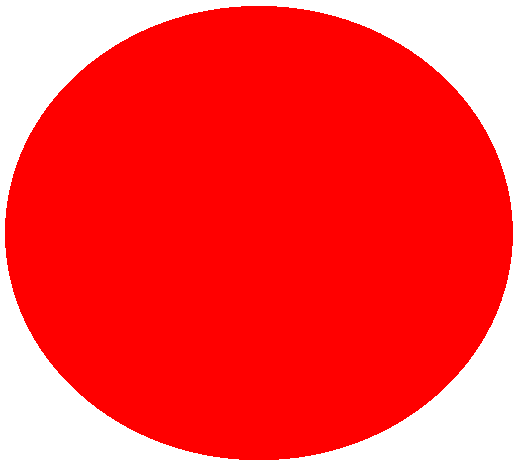

# Simple-Platformer-Game-with-Reload-Mechanism-Godot-
<h3>Default Sprites and Animation Player and Enemy</h3>

<table>
  <tr>
    <th>Idle Animation</th>
    <th>Firing Animation</th>
  </tr>
  <tr>
    <td> </td>
    <td></td>
  </tr>

  <table> <!---Table for Enemy--->
    <th> Enemy Skin </th> <!---Enemy Header --->
    <tr> <!---Contents--->
      <td> </td>
    </tr>
    #
